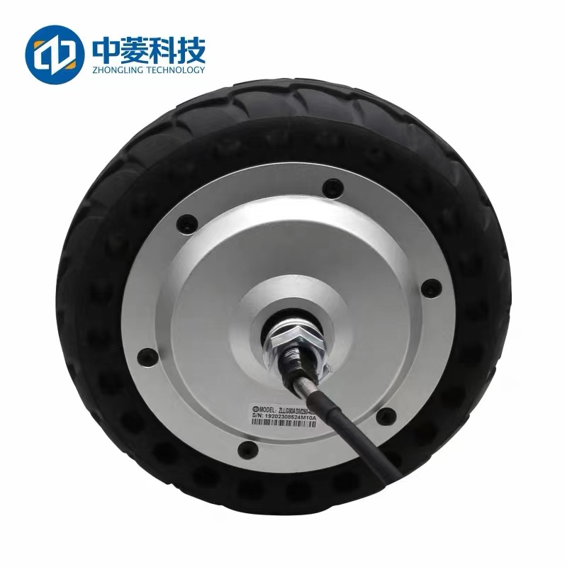
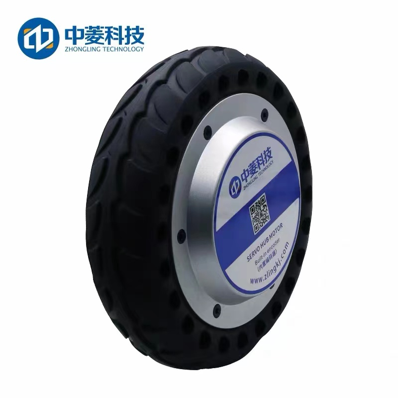
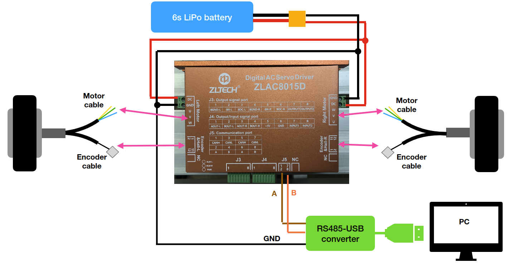

# A Python API of ZLAC8015D AC Servo Driver

This is a python API by using pymodbus to be able to access registers of ZLAC8015D.

You can find more detail of ZLAC8015D on their official site [here](http://www.zlrobotmotor.com/info/401.html).

## Hardware

ZLAC8015D is only compatible with dual 8 inch motors size.

Along with the driver, you will need to have RS485-USB converter to plug it on your PC. Please check on the following diagram.

## Dependency

	sudo pip install pymodbus

## Features

- Velocity control, we can send command RPMs and also read feedback RPMs from the motors, please check on `test_speed_control.py`

- Position control, we can send how much angle or even direct distance to travel, in case of we are using default 8 inch wheel the circumference distance would be 0.655 meters. Please check on `test_position_control.py`.

Those two control modes can be switched during operation, the initialization step has to be done every times when changed to another mode.

***Remark***

`get_rpm()` can be called in velocity control mode, but couldn't get feedback if in position control mode.

`get_wheels_travelled()` can be called in both modes.

`modbus_fail_read_handler()` is a helper function to handle failure read because some there is error of ModbusIOException.

## Registers

For more information of data registers and example packets, please check on [docs](./docs/).